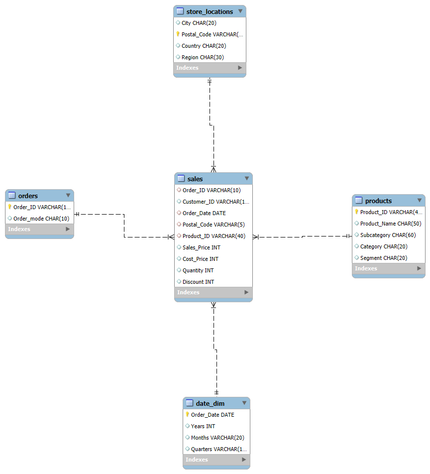
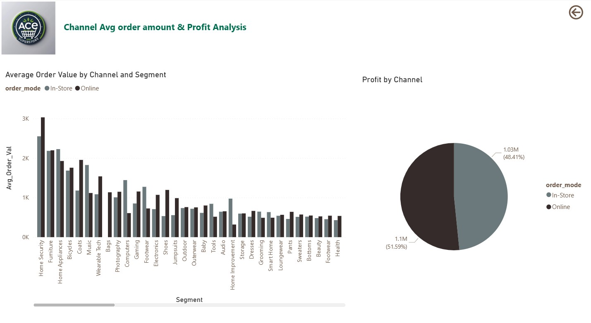
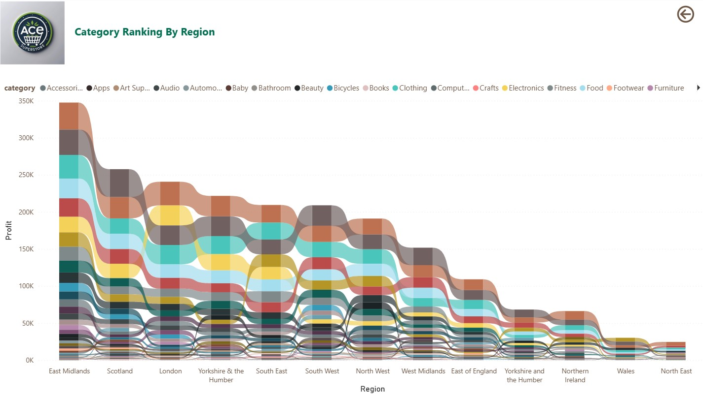

# RDAMP-Dimensional-Model-PowerBI
#  Sales Data Analysis with Power BI and MySQL

This project demonstrates a complete data analytics pipeline using a **dimensional star schema** hosted in **MySQL**, with analysis and reporting done in **Power BI**. It covers schema design, SQL setup, and Power BI data connection and visualisation for meaningful business insights.

---

## Dimensional Schema Overview



The model follows a **Star Schema** design, consisting of:
- **1 Fact Table**: `sales`
- **4 Dimension Tables**: `product_dim`, `order_dim`, `store_locations_dim`, `date_dim`

---

## Purpose of Each Table

### Fact Table: `sales`
Captures business transactions and metrics. Includes:
- **Foreign Keys**: `Product_ID`, `Order_ID`, `Customer_ID`, `Postal_Code`, `Order_Date`
- **Measures**: `sales_price`, `cost_price`, `quantity_sold`, `discount`

### Dimension Tables

#### `product_dim`
- **Primary Key**: `Product_ID`
- **Attributes**: `Product_Name`, `Category`, `Segment`, `Subcategory`
- **Purpose**: Enables product-level hierarchy and filtering.

#### `order_dim`
- **Primary Key**: `Order_ID`
- **Attributes**: `Order_Mode`
- **Purpose**: Identifies sales channels (e.g., online, in-store).

#### `store_locations_dim`
- **Primary Key**: `Postal_Code`
- **Attributes**: `City`, `Country`, `Region`
- **Purpose**: Enables geographic-based analytics.

#### `date_dim`
- **Primary Key**: `Order_Date`
- **Attributes**: `Month`, `Year`, `Quarter`
- **Purpose**: Enables time-based trend analysis.

---

##  MySQL Workbench 8.0 Setup Instructions

- Installed MySQL Workbench 8.0.42 and created a database:
   ```sql
   CREATE DATABASE IF NOT EXISTS rdamp;
   USE rdamp;

##  SQL Queries 
 -**Created the Tables**
 
 

-**Created 5 Views & 5 reusable SQL queries in MySQL**


---

## Power BI Connection Steps
**Installed MySQL ODBC Driver & MySQL connector net**

 **Connected Power BI to MySQL**
1. Opened **Power BI Desktop**.
2. Clicked **Home > Get Data > More > Database > MySQL database**.
3. Pressed **Connect**.
4. Entered the server and database details in the window as shown below:  
   
5. Entered the MySQL login credentials in the login window:  
   
6. Selected the required views from the Navigator window:  
   

---

## Power BI Report Screenshots

### Product Seasonality Trends


---

### Discount vs. Profit Analysis


---

### Average Order Value by Channel and Segment



---

### Top 10 Customers by Profit Contribution


---

### Category Ranking by Region



---

### Sales Contribution by segment and category


---
